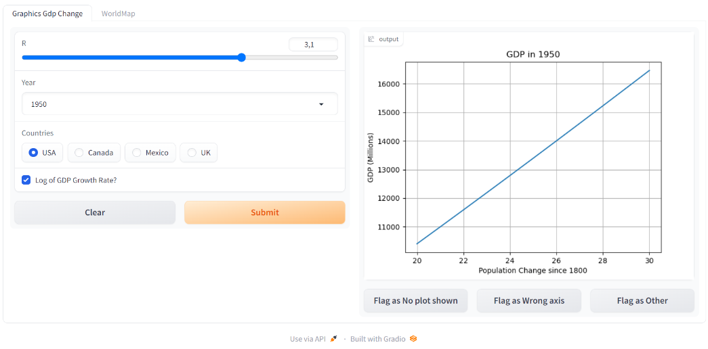
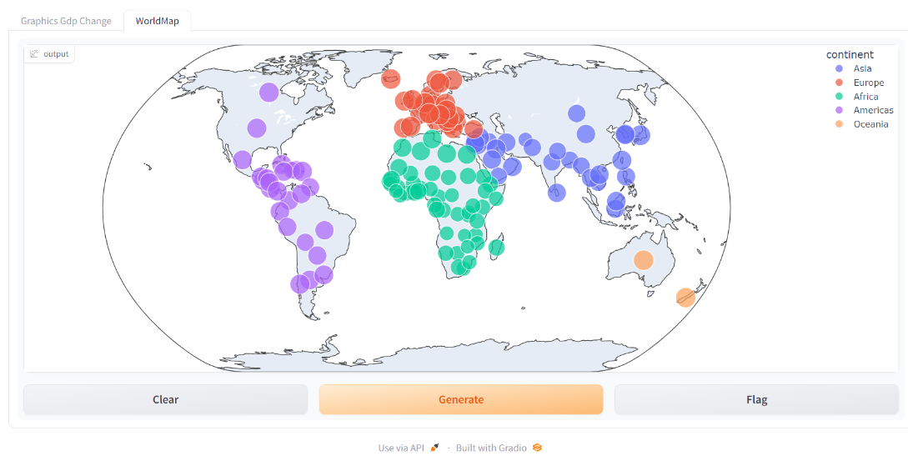

# Graphics Solutions
GDP change plus Worldmap with geo information

## 🤔 What is this?
**Description:**  
Graphic solutions with Gradio UI:
 - GDP change: based matplolib.pyplot
 - Worldmap with geo informationm based plotly.express

## 📚 Data

##  🚀 Quick Install

pip install -r requirements.txt` #install environment.

run python file (Graphics_Solutions). Graphics_Solutions.py import Graphic.py and WorldMap.py, and call the 2 functions (app_gdp and app_worldmap)

## 📖 Documentation / UI

🧮 **GDP change UI**: 

 

🧮 **World Map UI**: 

 

Please see docs dir for full documentation.

