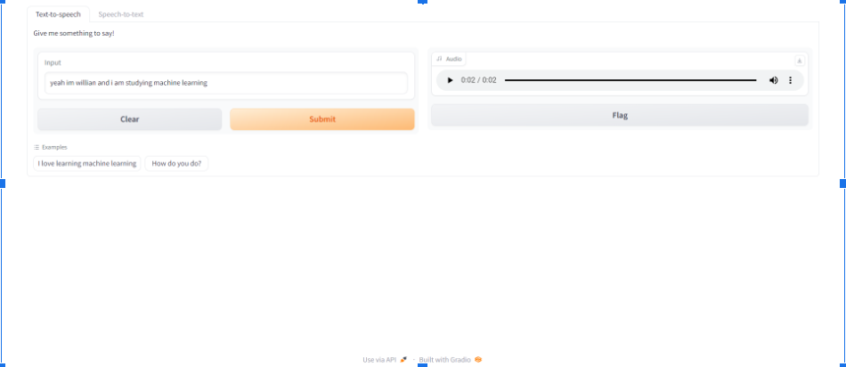
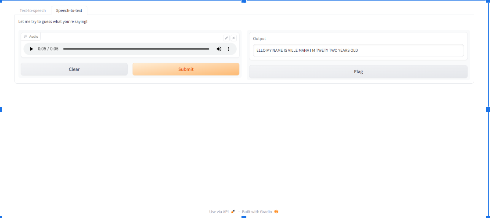

# Graphics Solutions
GDP change plus Worldmap with geo information

## 🤔 What is this?
**Description:**  
Graphic solutions with Gradio UI:
 - GDP change
 - Worldmap with geo information

Both use pipeline (from Huggingface) to "call" the models

## 📚 Data

Pre-trained models in their specific functions. No need for fine-tuned.
Data is introduced by users

##  🚀 Quick Install

pip install -r requirements.txt` #install environment.

run python file (Voice_Text_Solutions).

## 📖 Documentation / UI

🧮 **Text2Speech (TTS) UI**: 

 

🧮 **Speech2Text (STT) UI**: 

 

Please see docs dir for full documentation.

